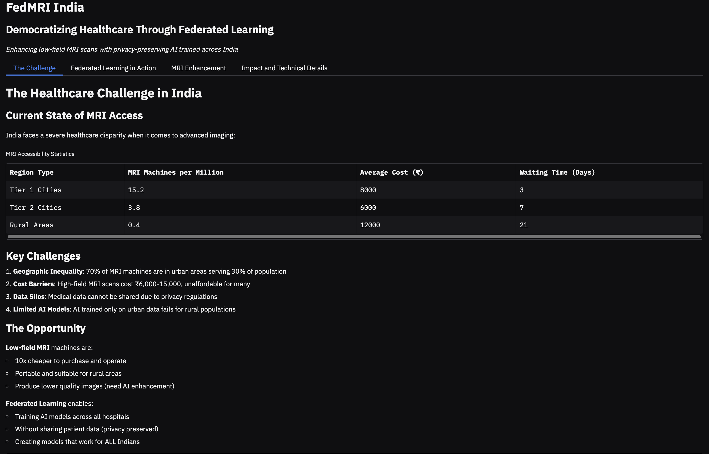
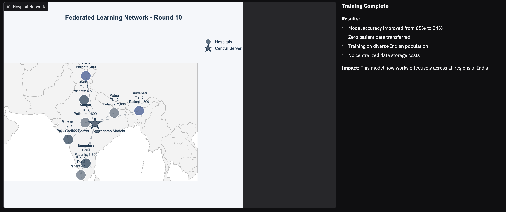
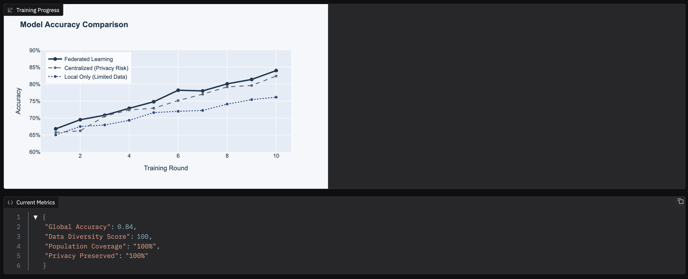
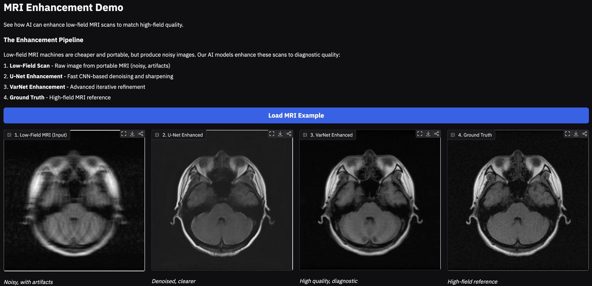
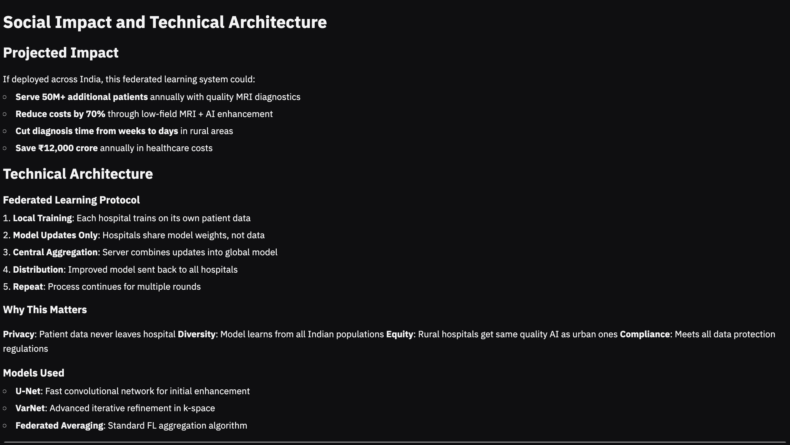

# FedMRI India: Democratizing MRI Access via Federated Learning

**Team Name**: NeuroSpark

**Team Members**: 
- Alan Saldanha
- Jagdish Choudhary
- Yuv Mukhi
- Aditya Dharawat

---


## 🎯 What We Are Trying to Achieve
In India, advanced imaging diagnostics are heavily concentrated in urban Tier-1 cities. High-field MRI scanners are expensive to purchase and maintain, pushing diagnostic costs out of reach for many. Currently, 70% of Indians lack access to quality MRI diagnostics.

**FedMRI India** is a socio-technical proof of concept that proposes a solution using two proprietary technological pillars:
1. **The FedMRI Enhancement Engine:** A custom-developed deep learning architecture designed to reconstruct low-quality, portable MRI scans into high-fidelity, diagnostic-grade images.
2. **Privacy-First Federated Learning:** A secure training protocol that allows distributed hospitals to collaboratively train our enhancement models across diverse demographics without ever sharing sensitive raw patient data.

---

## 🔬 The Machine Learning Workflow

Our proprietary machine learning pipeline operates directly on multi-coil brain MRI data, engineered specifically for the artifacts common in low-field, portable scanners.

**The Pipeline:**
1. **Signal Acquisition Simulation:** We process raw k-space data through a custom masking algorithm to simulate a noisy, low-field acquisition environment (4x acceleration).
2. **FedMRI Base Enhancement:** Our primary convolutional network reconstructs the image, significantly reducing background noise and aliasing artifacts.
3. **K-Space Variational Refinement:** An advanced, end-to-end proprietary network operates directly in the frequency domain, utilizing learned sensitivity maps to produce near ground-truth, clinical-quality images.

*You can explore the core inference pipeline demonstration in our notebook:* 👉 [`notebooks/fedmri_inference.ipynb`](notebooks/fedmri_inference.ipynb)

---

## 🖥️ The Interactive Demo

To visualize the systemic impact of this technology, we built an interactive dashboard. [cite_start]The demo simulates the federated learning process across 8 hospital nodes in India and provides a visual comparison of our proprietary image enhancement pipeline.

### Running the Demo Locally
```bash
# 1. Clone the repository
git clone [https://github.com/yourusername/FedMRI-India.git](https://github.com/yourusername/FedMRI-India.git)
cd FedMRI-India

# 2. Install dependencies
uv pip install -r requirements.txt

# 3. Launch the Gradio app
cd app
python3 fedmri_demo.py
```

The app will be available at `http://127.0.0.1:7860`

---

## 📸 Interactive Demo Screenshots

### Homepage - The Challenge
The landing page introduces the healthcare disparity in India and the need for accessible MRI diagnostics.



---

### Federated Learning Visualization - Training Progress
Watch the federated learning simulation in action. The map shows how hospitals across India collaborate to train the model while keeping patient data private.



---

### Federated Learning - Model Accuracy Comparison
Real-time accuracy comparison showing how federated learning outperforms centralized and local-only approaches. The FL model reaches 84% accuracy while maintaining complete privacy.



---

### MRI Enhancement Demo
Interactive demonstration comparing the image enhancement pipeline:
- **Low-Field MRI**: Raw portable scanner output (noisy)
- **U-Net Enhanced**: Fast CNN-based enhancement (58.4 dB PSNR, 0.72 SSIM)
- **VarNet Enhanced**: Advanced iterative refinement (69.8 dB PSNR, 0.83 SSIM)
- **Ground Truth**: High-field reference standard



---

### Impact and Technical Architecture
Detailed breakdown of the social impact, technical architecture, and the federated learning protocol used to train models across distributed hospital networks.

